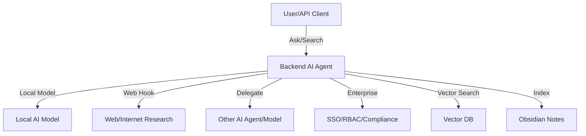

# OpenSpec Governance Guide

> **Governance:** Material updates to this document are governed by OpenSpec
> change proposals under the `project-documentation` capability. See
> `openspec/PROJECT_WORKFLOW.md` and related archived changes for reference.

## 🚀 Quick Start for Contributors

### First-Time Contributors (< 15 minutes to first proposal)

1. **Read this guide**: Understand the governance workflow (you're here!)
2. **Check existing work**: Run `openspec list` and `openspec list --specs` to see what exists
3. **Review the README**: See [`README.md`](./README.md) for directory structure and validation commands
4. **Pick a simple first change**: Start with typo fixes or small documentation updates
5. **Follow the workflow below**: Create proposal → validate → submit for review

### Experienced Contributors

1. **Decide scope:** New capability or modify existing (see `openspec/specs/project-documentation/spec.md`).
2. **Scaffold change:** Create `proposal.md`, `tasks.md`, and delta spec under `openspec/changes/<change-id>/specs/<capability>/spec.md`.
3. **Write delta:** Use `## ADDED|MODIFIED|REMOVED Requirements` and include at least one `#### Scenario:` per requirement.
4. **Validate:** Run `openspec validate <change-id> --strict` and resolve issues (format, scenarios, headings).
5. **Request approval:** Do not implement until proposal is approved.

## 📋 Governance Workflow

### Step 1: Understand What You're Changing

```bash
# List all existing capabilities
openspec list --specs

# Show a specific capability
openspec show project-documentation --type spec

# Search for specific content
rg "Backend agent" openspec/specs/
```

**Decision point**: Am I adding a new capability or modifying an existing one?

### Step 2: Create Your Change Proposal

```bash
# Choose a unique change ID (kebab-case, verb-led)
CHANGE_ID="update-doc-readme"

# Create the change directory structure
mkdir -p openspec/changes/$CHANGE_ID/specs/project-documentation
```

### Step 3: Write Your Proposal Files

#### Create `proposal.md`

```markdown
## Why

[Explain the problem or opportunity in 1-2 sentences]

## What Changes

- [List specific changes]
- [Mark breaking changes with **BREAKING**]

## Impact

- Affected specs: project-documentation
- Affected files: README.md
- Users impacted: All contributors
- Review priority: Medium
```

#### Create `tasks.md`

```markdown
## 1. Documentation Updates

- [ ] 1.1 Update README.md with new content
- [ ] 1.2 Add cross-references to related docs
- [ ] 1.3 Update table of contents

## 2. Validation

- [ ] 2.1 Run `openspec validate --strict`
- [ ] 2.2 Check markdown formatting
- [ ] 2.3 Verify all links work

## 3. Review

- [ ] 3.1 Self-review for clarity
- [ ] 3.2 Submit for team review
- [ ] 3.3 Address feedback
```

#### Create Delta Spec: `specs/project-documentation/spec.md`

For **MODIFIED** requirements (changing existing content):

```markdown
## MODIFIED Requirements

### Requirement: Governance for README.md

The project SHALL govern material changes to `README.md` via OpenSpec change proposals to maintain consistency and review.

#### Scenario: Material change to README.md requires proposal

- **WHEN** a contributor plans a material update to `README.md`
- **THEN** they MUST create or update an OpenSpec change with deltas under `project-documentation`

#### Scenario: Minor typos can bypass proposal process

- **WHEN** a contributor fixes a typo or formatting issue in `README.md`
- **THEN** they MAY commit directly without a change proposal
```

For **ADDED** requirements (new content):

```markdown
## ADDED Requirements

### Requirement: Automated validation in CI

The system SHALL automatically validate all OpenSpec changes in the CI/CD pipeline.

#### Scenario: Pull request validation

- **WHEN** a pull request includes OpenSpec changes
- **THEN** the CI system SHALL run `openspec validate --strict` and report results
```

### Step 4: Validate Your Change

```bash
# Validate your specific change
openspec validate $CHANGE_ID --strict

# Check JSON output for details
openspec validate $CHANGE_ID --strict --json

# Validate all pending changes
openspec validate --strict --changes
```

**Common validation errors and fixes:**

| Error | Cause | Fix |
|-------|-------|-----|
| "Requirement must contain SHALL or MUST" | Missing normative keyword | Add SHALL/MUST to first sentence after heading |
| "Requirement must have at least one scenario" | No scenarios or wrong format | Add `#### Scenario:` with WHEN/THEN |
| "Change must have at least one delta" | No ADDED/MODIFIED/REMOVED sections | Add operation header |
| MD022/MD032 linting errors | Blank line issues | Check `.markdownlint.json` for disabled rules |

### Step 5: Submit for Review

1. **Self-review checklist:**
   - [ ] All validation errors resolved
   - [ ] Proposal clearly explains Why and What
   - [ ] Tasks are specific and measurable
   - [ ] Scenarios follow WHEN/THEN format
   - [ ] Cross-references are accurate

2. **Create pull request** (or notify reviewers)

3. **Address review feedback**

4. **Wait for approval** before implementation

### Step 6: Implement (After Approval)

```bash
# Track tasks as you complete them
# Update tasks.md: - [ ] → - [x]

# Keep validating as you work
openspec validate $CHANGE_ID --strict

# Ensure all tasks complete before final review
```

### Step 7: Archive (After Deployment)

```bash
# Archive the completed change
openspec archive $CHANGE_ID

# For non-interactive/automation
openspec archive $CHANGE_ID --yes

# Validate the archive succeeded
openspec validate --strict
```

## 🎯 Success Criteria

Your change proposal is ready when:

- ✅ `openspec validate --strict` passes with 0 errors
- ✅ `proposal.md` clearly explains Why and What
- ✅ `tasks.md` has ≥3 specific, measurable tasks
- ✅ Delta spec has ≥1 scenario per requirement
- ✅ All scenarios use `#### Scenario:` format with WHEN/THEN
- ✅ MODIFIED deltas include full updated requirement text
- ✅ File paths and references are accurate

## 📚 Learning Path

### Level 1: First Contribution (Typo Fix)

**Goal**: Make your first successful change

**Steps**:
1. Find a typo in any governed documentation
2. Create change proposal with MODIFIED delta
3. Run validation and fix any errors
4. Submit for review

**Expected time**: 30 minutes

### Level 2: Documentation Update

**Goal**: Add meaningful content to documentation

**Steps**:
1. Identify a documentation gap
2. Create comprehensive change proposal
3. Write clear ADDED or MODIFIED requirements
4. Add multiple scenarios to cover edge cases
5. Validate and submit

**Expected time**: 1-2 hours

### Level 3: Cross-Cutting Change

**Goal**: Update multiple related documents

**Steps**:
1. Plan changes across multiple files
2. Create multi-delta proposal
3. Coordinate cross-references
4. Ensure consistency across all changes
5. Comprehensive validation

**Expected time**: 2-4 hours

### Level 4: New Capability

**Goal**: Propose an entirely new governed capability

**Steps**:
1. Research and justify new capability
2. Design capability structure
3. Write comprehensive requirements and scenarios
4. Create example change deltas
5. Document governance workflows

**Expected time**: 4-8 hours

## 🔧 Pro Tips

### Efficiency Hacks

- **Use templates**: Copy from `changes/update-doc-readme/` as a starting point
- **Validate early**: Run `openspec validate --strict` after every file creation
- **JSON debugging**: Use `--json` flag to parse errors programmatically
- **Batch operations**: Validate all changes at once with `openspec validate --strict --changes`

### Quality Shortcuts

- **Scenario coverage**: Write scenarios before requirement text to ensure completeness
- **Cross-reference check**: Use `rg "file-name"` to find all mentions before updating
- **Markdown preview**: Use VS Code or similar to preview formatting before validating

### Collaboration Tips

- **Check active changes**: Run `openspec list` before starting to avoid conflicts
- **Coordinate deltas**: If multiple people editing same capability, sync early
- **Review others' work**: Learn patterns from approved changes in `archive/`

## 🆘 Getting Help

### Self-Service Resources

1. **Troubleshooting guide**: See [`docs/troubleshooting.md`](./docs/troubleshooting.md) _(planned)_
2. **Change patterns**: Review [`docs/change-patterns.md`](./docs/change-patterns.md) _(planned)_
3. **Existing examples**: Browse `openspec/changes/` for successful patterns
4. **Validation output**: Use `--json` flag to get detailed error information

### Ask for Help

- **GitHub Issues**: For questions about governance workflow
- **Pull Request Comments**: For specific change feedback
- **Team Chat**: For real-time guidance (if available)

## 📊 Governance Metrics

Track your progress:

- **First proposal**: Time from start to first validated proposal
- **Validation success rate**: Proposals passing strict validation on first try
- **Review cycles**: Number of iterations before approval
- **Contribution velocity**: Changes per month

**Project targets:**
- First proposal: < 1 hour
- Validation success: > 95%
- Review cycles: < 2 iterations
- Time to approval: < 24 hours

---

## How to Propose and Validate Documentation Changes (Legacy Quickstart)

1. **Decide scope:** New capability or modify existing (see `openspec/specs/project-documentation/spec.md`).
2. **Scaffold change:** Create `proposal.md`, `tasks.md`, and delta spec under `openspec/changes/<change-id>/specs/<capability>/spec.md`.
3. **Write delta:** Use `## ADDED|MODIFIED|REMOVED Requirements` and include at least one `#### Scenario:` per requirement.
4. **Validate:** Run `openspec validate <change-id> --strict` and resolve issues (format, scenarios, headings).
5. **Request approval:** Do not implement until proposal is approved.

### Example: Compliant MODIFIED Delta

See: [System Architecture Spec Delta](openspec/changes/update-doc-docs-system-architecture-specification/specs/project-documentation/spec.md)

### Common Pitfalls
- Missing or misformatted scenario headers (`#### Scenario:` required)
- Delta type mismatch (use MODIFIED for changes to existing requirements, ADDED for new ones)
- Incomplete requirement content in MODIFIED deltas (must paste full updated requirement)
- Duplicate headings (violates markdown lint)

### Governed Files and Change History (Summary)

| File/Artifact                              | Governance Requirement | Last Change Delta Example |
|--------------------------------------------|------------------------|--------------------------|
| docs/SYSTEM_ARCHITECTURE_SPECIFICATION.md  | Yes                    | update-doc-docs-system-architecture-specification |
| docs/SECURITY_SPECIFICATION.md             | Yes                    | update-doc-docs-security-specification           |
| README.md                                  | Yes                    | update-doc-readme                                 |
| AGENTS.md                                  | Yes                    | update-doc-agents                                 |
| .github/copilot-instructions.md            | Yes                    | update-doc-copilot-instructions                   |
| ... (see spec.md for full list)            | Yes                    | ...                                              |

# Backend as Modular AI Agent

## OpenSpec Instructions

## Architecture Diagram



## Usage Example: Multi-Agent Orchestration

```python
# Example: Ask a question, route to local model, fallback to web research if allowed
def ask_question(question, allow_web=False):
  answer = agent_agent.ask_local_model(question)
  if not answer and allow_web:
    answer = agent_agent.ask_web_research(question)
  return answer
```

## Contributor Guidance

When adding orchestration, model routing, or agent-to-agent features:

- Update this diagram and usage example
- Document new API endpoints and agent flows

- Uses local compute AI models for offline/private answers
- Can use web hooks and internet access (if enabled) for external research
- Supports routing requests to other AI agents or models for multi-agent workflows
- Integrates enterprise features (SSO, RBAC, compliance) and extensible orchestration

## Architecture Modes

- **Offline/local**: Answers and research are performed using only local models and data
- **Connected/internet-enabled**: Backend can fetch, summarize, and analyze external content via web hooks or remote models
- **Multi-agent orchestration**: Requests can be delegated or routed to other
  agents/models for broader research or specialized tasks

### Mode enforcement

- Offline mode: No outbound network calls. Operations restricted to local models and local data sources.
- Connected mode: Outbound requests MUST be performed only via approved web
  hooks or configured providers, respecting security and compliance settings.

## Mode Change Guidance

- When extending backend agent capabilities, update AGENTS.md and
  project-documentation/spec.md to reflect new orchestration, model routing,
  or research features
- Ensure documentation covers both offline and connected modes

When changing mode behavior (offline/connected):

- Document enforcement rules (no-network offline; approved providers only when connected)
- Update examples and diagrams to reflect the new behavior

Instructions for AI coding assistants using OpenSpec for spec-driven development.

## TL;DR Quick Checklist

- Search existing work: `openspec spec list --long`, `openspec list` (use `rg` only for full-text search)

- Decide scope: new capability vs modify existing capability

- Pick a unique `change-id`: kebab-case, verb-led (`add-`, `update-`, `remove-`, `refactor-`)

- Scaffold: `proposal.md`, `tasks.md`, `design.md` (only if needed), and delta specs per affected capability

- Write deltas: use `## ADDED|MODIFIED|REMOVED|RENAMED Requirements`; include at least one `#### Scenario:` per requirement

- Validate: `openspec validate [change-id] --strict` and fix issues

- Request approval: Do not start implementation until proposal is approved

## Three-Stage Workflow

### Stage 1: Creating Changes

Create proposal when you need to:

- Add features or functionality

- Make breaking changes (API, schema)

- Change architecture or patterns

- Optimize performance (changes behavior)

- Update security patterns

Triggers (examples):

- "Help me create a change proposal"

- "Help me plan a change"

- "Help me create a proposal"

- "I want to create a spec proposal"

- "I want to create a spec"

Loose matching guidance:

- Contains one of: `proposal`, `change`, `spec`

- With one of: `create`, `plan`, `make`, `start`, `help`

Skip proposal for:

- Bug fixes (restore intended behavior)

- Typos, formatting, comments

- Dependency updates (non-breaking)

- Configuration changes

- Tests for existing behavior

#### Workflow

1. Review `openspec/project.md`, `openspec list`, and `openspec list --specs` to understand current context.

1. Choose a unique verb-led `change-id` and scaffold `proposal.md`, `tasks.md`,
   optional `design.md`, and spec deltas under `openspec/changes/<id>/`.

1. Draft spec deltas using `## ADDED|MODIFIED|REMOVED Requirements` with at least one `#### Scenario:` per requirement.

1. Run `openspec validate <id> --strict` and resolve any issues before sharing the proposal.

### Stage 2: Implementing Changes

Track these steps as TODOs and complete them one by one.

1. **Read proposal.md** - Understand what's being built

1. **Read design.md** (if exists) - Review technical decisions

1. **Read tasks.md** - Get implementation checklist

1. **Implement tasks sequentially** - Complete in order

1. **Confirm completion** - Ensure every item in `tasks.md` is finished before updating statuses

1. **Update checklist** - After all work is done, set every task to `- [x]` so the list reflects reality

1. **Approval gate** - Do not start implementation until the proposal is reviewed and approved

### Stage 3: Archiving Changes

After deployment, create separate PR to:

- Move `changes/[name]/` → `archive/YYYY-MM-DD-[name]/`

- Update `specs/` if capabilities changed

- Use `openspec archive [change] --skip-specs --yes` for tooling-only changes

- Run `openspec validate --strict` to confirm the archived change passes checks

## Before Any Task

### Context Checklist

- [ ] Read relevant specs in `specs/[capability]/spec.md`

- [ ] Check pending changes in `changes/` for conflicts

- [ ] Read `openspec/project.md` for conventions

- [ ] Run `openspec list` to see active changes

- [ ] Run `openspec list --specs` to see existing capabilities

### Before Creating Specs

- Always check if capability already exists

- Prefer modifying existing specs over creating duplicates

- Use `openspec show [spec]` to review current state

- If request is ambiguous, ask 1–2 clarifying questions before scaffolding

### Search Guidance

- Enumerate specs: `openspec spec list --long` (or `--json` for scripts)

- Enumerate changes: `openspec list` (or `openspec change list --json` - deprecated but available)

- Show details:

- Spec: `openspec show <spec-id> --type spec` (use `--json` for filters)

- Change: `openspec show <change-id> --json --deltas-only`

- Full-text search (use ripgrep): `rg -n "Requirement:|Scenario:" openspec/specs`

## Quick Start

### CLI Commands

```bash

# Essential commands

openspec list                  # List active changes
openspec list --specs          # List specifications
openspec show [item]           # Display change or spec
openspec diff [change]         # Show spec differences
openspec validate [item]       # Validate changes or specs
openspec archive [change] [--yes|-y]      # Archive after deployment (add --yes for non-interactive runs)

# Project management

openspec init [path]           # Initialize OpenSpec
openspec update [path]         # Update instruction files

# Interactive mode

openspec show                  # Prompts for selection
openspec validate              # Bulk validation mode

# Debugging

openspec show [change] --json --deltas-only
openspec validate [change] --strict
```

### Command Flags

- `--json` - Machine-readable output

- `--type change|spec` - Disambiguate items

- `--strict` - Comprehensive validation

- `--no-interactive` - Disable prompts

- `--skip-specs` - Archive without spec updates

- `--yes`/`-y` - Skip confirmation prompts (non-interactive archive)

## Directory Structure

```text
openspec/
├── project.md              # Project conventions
├── specs/                  # Current truth - what IS built
│   └── [capability]/       # Single focused capability
│       ├── spec.md         # Requirements and scenarios
│       └── design.md       # Technical patterns
├── changes/                # Proposals - what SHOULD change
│   ├── [change-name]/
│   │   ├── proposal.md     # Why, what, impact
│   │   ├── tasks.md        # Implementation checklist
│   │   ├── design.md       # Technical decisions (optional; see criteria)
│   │   └── specs/          # Delta changes
│   │       └── [capability]/
│   │           └── spec.md # ADDED/MODIFIED/REMOVED
│   └── archive/            # Completed changes
```

## Creating Change Proposals

### Decision Tree

```text
New request?
├─ Bug fix restoring spec behavior? → Fix directly
├─ Typo/format/comment? → Fix directly
├─ New feature/capability? → Create proposal
├─ Breaking change? → Create proposal
├─ Architecture change? → Create proposal
└─ Unclear? → Create proposal (safer)
```

### Proposal Structure

1. **Create directory:** `changes/[change-id]/` (kebab-case, verb-led, unique)

1. **Write proposal.md:**

```markdown

## Why

[1-2 sentences on problem/opportunity]

## What Changes

- [Bullet list of changes]

- [Mark breaking changes with **BREAKING**]

## Impact

- Affected specs: [list capabilities]

- Affected code: [key files/systems]
```

1. **Create spec deltas:** `specs/[capability]/spec.md`

```markdown

## ADDED Requirements

### Requirement: New Feature

The system SHALL provide...

#### Scenario: Success case

- **WHEN** user performs action

- **THEN** expected result

## MODIFIED Requirements

### Requirement: Existing Feature

[Complete modified requirement]

## REMOVED Requirements

### Requirement: Old Feature

#### Reason

[Why removing]

#### Migration

[How to handle]
```

If multiple capabilities are affected, create multiple delta files under
`changes/[change-id]/specs/<capability>/spec.md`—one per capability.

1. **Create tasks.md:**

```markdown

## 1. Implementation

- [ ] 1.1 Create database schema

- [ ] 1.2 Implement API endpoint

- [ ] 1.3 Add frontend component

- [ ] 1.4 Write tests
```

1. **Create design.md when needed:**

Create `design.md` if any of the following apply; otherwise omit it:

- Cross-cutting change (multiple services/modules) or a new architectural pattern

- New external dependency or significant data model changes

- Security, performance, or migration complexity

- Ambiguity that benefits from technical decisions before coding

Minimal `design.md` skeleton:

```markdown

## Context

[Background, constraints, stakeholders]

## Goals / Non-Goals

- Goals: [...]

- Non-Goals: [...]

## Decisions

- Decision: [What and why]

- Alternatives considered: [Options + rationale]

## Risks / Trade-offs

- [Risk] → Mitigation

## Migration Plan

[Steps, rollback]

## Open Questions

- [...]
```

## Spec File Format

### Critical: Scenario Formatting

CORRECT (use #### headers):

```markdown

#### Scenario: User login success

- **WHEN** valid credentials provided

- **THEN** return JWT token
```

WRONG (don't use bullets or bold):

```markdown

- **Scenario: User login** ❌
  Scenario (bold-only) example: User login ❌

### Scenario: User login ❌

```

Every requirement MUST have at least one scenario.

### Requirement Wording

- Use SHALL/MUST for normative requirements (avoid should/may unless intentionally non-normative)

### Delta Operations

- `## ADDED Requirements` - New capabilities

- `## MODIFIED Requirements` - Changed behavior

- `## REMOVED Requirements` - Deprecated features

- `## RENAMED Requirements` - Name changes

Headers matched with `trim(header)` - whitespace ignored.

#### When to use ADDED vs MODIFIED

- ADDED: Introduces a new capability or sub-capability that can stand alone as a
  requirement. Prefer ADDED when the change is orthogonal (e.g., adding "Slash
  Command Configuration") rather than altering the semantics of an existing
  requirement.

- MODIFIED: Changes the behavior, scope, or acceptance criteria of an existing
  requirement. Always paste the full, updated requirement content (header + all
  scenarios). The archiver will replace the entire requirement with what you
  provide here; partial deltas will drop previous details.

- RENAMED: Use when only the name changes. If you also change behavior, use
  RENAMED (name) plus MODIFIED (content) referencing the new name.

Common pitfall: Using MODIFIED to add a new concern without including the
previous text. This causes loss of detail at archive time. If you aren’t
explicitly changing the existing requirement, add a new requirement under ADDED
instead.

Authoring a MODIFIED requirement correctly:

1. Locate the existing requirement in `openspec/specs/<capability>/spec.md`.

2. Copy the entire requirement block (from `### Requirement: ...` through its scenarios).

3. Paste it under `## MODIFIED Requirements` and edit to reflect the new behavior.

4. Ensure the header text matches exactly (whitespace-insensitive) and keep at least one `#### Scenario:`.

Example for RENAMED:

```markdown

## RENAMED Requirements

- FROM: `### Requirement: Login`

- TO: `### Requirement: User Authentication`
```

## Troubleshooting

### Common Errors

#### Change must have at least one delta

- Check `changes/[name]/specs/` exists with .md files

- Verify files have operation prefixes (## ADDED Requirements)

#### Requirement must have at least one scenario

- Check scenarios use `#### Scenario:` format (4 hashtags)

- Don't use bullet points or bold for scenario headers

#### Silent scenario parsing failures

- Exact format required: `#### Scenario: Name`

- Debug with: `openspec show [change] --json --deltas-only`

### Validation Tips

```bash

# Always use strict mode for comprehensive checks

openspec validate [change] --strict

# Debug delta parsing

openspec show [change] --json | jq '.deltas'

# Check specific requirement

openspec show [spec] --json -r 1
```

## Happy Path Script

```bash

# 1) Explore current state

openspec spec list --long
openspec list

# Optional full-text search:

# rg -n "Requirement:|Scenario:" openspec/specs

# rg -n "^#|Requirement:" openspec/changes

# 2) Choose change id and scaffold

CHANGE=add-two-factor-auth
mkdir -p openspec/changes/$CHANGE/{specs/auth}
printf "## Why\n...\n\n## What Changes\n- ...\n\n## Impact\n- ...\n" > openspec/changes/$CHANGE/proposal.md
printf "## 1. Implementation\n- [ ] 1.1 ...\n" > openspec/changes/$CHANGE/tasks.md

# 3) Add deltas (example)

cat > openspec/changes/$CHANGE/specs/auth/spec.md << 'EOF'

## ADDED Requirements

### Requirement: Two-Factor Authentication

Users MUST provide a second factor during login.

#### Scenario: OTP required

- **WHEN** valid credentials are provided

- **THEN** an OTP challenge is required
EOF

# 4) Validate

openspec validate $CHANGE --strict
```

## Multi-Capability Example

```text
openspec/changes/add-2fa-notify/
├── proposal.md
├── tasks.md
└── specs/
    ├── auth/
    │   └── spec.md   # ADDED: Two-Factor Authentication
    └── notifications/
        └── spec.md   # ADDED: OTP email notification
```

auth/spec.md

```markdown

## ADDED Requirements

### Requirement: Two-Factor Authentication

...
```

notifications/spec.md

```markdown

## ADDED Requirements

### Requirement: OTP Email Notification

...
```

## Best Practices

### Simplicity First

- Default to <100 lines of new code

- Single-file implementations until proven insufficient

- Avoid frameworks without clear justification

- Choose boring, proven patterns

### Complexity Triggers

Only add complexity with:

- Performance data showing current solution too slow

- Concrete scale requirements (>1000 users, >100MB data)

- Multiple proven use cases requiring abstraction

### Clear References

- Use `file.ts:42` format for code locations

- Reference specs as `specs/auth/spec.md`

- Link related changes and PRs

### Capability Naming

- Use verb-noun: `user-auth`, `payment-capture`

- Single purpose per capability

- 10-minute understandability rule

- Split if description needs "AND"

### Change ID Naming

- Use kebab-case, short and descriptive: `add-two-factor-auth`

- Prefer verb-led prefixes: `add-`, `update-`, `remove-`, `refactor-`

- Ensure uniqueness; if taken, append `-2`, `-3`, etc.

## Tool Selection Guide

| Task                  | Tool | Why                      |
| --------------------- | ---- | ------------------------ |
| Find files by pattern | Glob | Fast pattern matching    |
| Search code content   | Grep | Optimized regex search   |
| Read specific files   | Read | Direct file access       |
| Explore unknown scope | Task | Multi-step investigation |

## Error Recovery

### Change Conflicts

1. Run `openspec list` to see active changes

1. Check for overlapping specs

1. Coordinate with change owners

1. Consider combining proposals

### Validation Failures

1. Run with `--strict` flag

1. Check JSON output for details

1. Verify spec file format

1. Ensure scenarios properly formatted

### Missing Context

1. Read project.md first

1. Check related specs

1. Review recent archives

1. Ask for clarification

## Quick Reference

### Stage Indicators

- `changes/` - Proposed, not yet built

- `specs/` - Built and deployed

- `archive/` - Completed changes

### File Purposes

- `proposal.md` - Why and what

- `tasks.md` - Implementation steps

- `design.md` - Technical decisions

- `spec.md` - Requirements and behavior

### CLI Essentials

```bash
openspec list              # What's in progress?
openspec show [item]       # View details
openspec diff [change]     # What's changing?
openspec validate --strict # Is it correct?
openspec archive [change] [--yes|-y]  # Mark complete (add --yes for automation)
```

Remember: Specs are truth. Changes are proposals. Keep them in sync.

## OpenSpec AGENTS

### Documentation Governance

This file is covered by OpenSpec governance. All changes are tracked via
proposals in `openspec/changes/` and must follow the required structure:

- `proposal.md`: Change proposal and rationale

- `tasks.md`: Implementation checklist (≥3 items)

- `specs/project-documentation/spec.md`: Capability documentation

See `README.md` and `.github/copilot-instructions.md` for compliance details.
