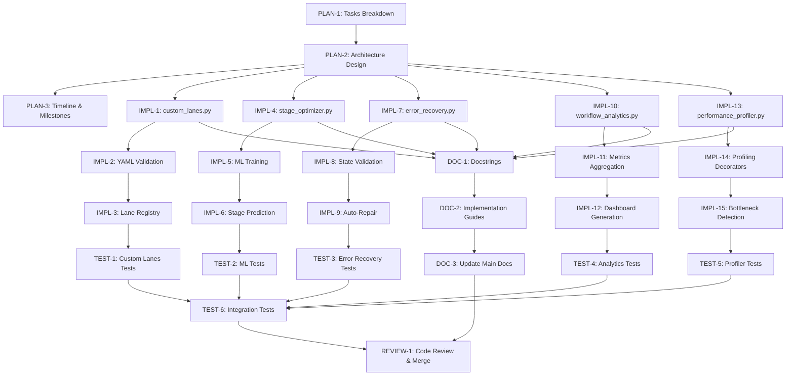

# Tasks: v0.1.46 Workflow Enhancement Cycle

---

## Document Overview

**Purpose**: Break down the v0.1.46 workflow enhancements into actionable, trackable tasks with dependencies and acceptance criteria.

**Change ID**: `workflow-enhancements-v0.1.46`

**Related Documents**:
- **Proposal**: [V0_1_46_PROPOSAL.md](./V0_1_46_PROPOSAL.md)
- **Specification**: [V0_1_46_SPEC.md](./V0_1_46_SPEC.md)
- **Analysis**: [V0_1_46_ENHANCEMENT_ANALYSIS.md](./V0_1_46_ENHANCEMENT_ANALYSIS.md)

**Owner**: @kdejo

**Status**: Planning (not-started)

**Last Updated**: October 24, 2025

---

## Task Categories Legend

- **Implementation**: Core module development
- **Testing**: Unit/integration/E2E test creation
- **Documentation**: Code comments, guides, examples
- **Infrastructure**: Integration, deployment, tooling
- **Review**: Code review, design review, approval

---

## Priority & Effort Guide

**Priority Levels**:
- **P0**: Critical, blocking other tasks
- **P1**: High priority, required for release
- **P2**: Important but not blocking
- **P3**: Nice-to-have, can be deferred

**Effort Estimates**:
- **XS**: < 1 hour
- **S**: 1-4 hours
- **M**: 4-8 hours (1 day)
- **L**: 1-3 days
- **XL**: 3-5 days

---

## Table of Contents

01. [Task Summary](#task-summary)
02. [Task List](#task-list)
03. [Task Details](#task-details)
04. [Task Dependencies](#task-dependencies)
05. [Timeline & Milestones](#timeline--milestones)
06. [Resource Allocation](#resource-allocation)
07. [Risk Register](#risk-register)
08. [Success Criteria](#success-criteria)

---

## Task Summary

**Total Tasks**: 18  
**Completed**: 0  
**In Progress**: 0  
**Blocked**: 0  

**Estimated Total Effort**: 14 days (110 hours)

| Phase | Duration | Tasks | Owner |
|-------|----------|-------|-------|
| Planning | Oct 24-26 | PLAN-1 to PLAN-3 | @kdejo |
| Custom Lanes | Oct 27-28 | IMPL-1 to IMPL-3, TEST-1 | @kdejo |
| ML Optimization | Oct 29-30 | IMPL-4 to IMPL-6, TEST-2 | @kdejo |
| Error Recovery | Oct 31-Nov 1 | IMPL-7 to IMPL-9, TEST-3 | @kdejo |
| Analytics | Nov 2-3 | IMPL-10 to IMPL-12, TEST-4 | @kdejo |
| Performance | Nov 4-5 | IMPL-13 to IMPL-15, TEST-5 | @kdejo |
| QA & Docs | Nov 5-7 | TEST-6, DOC-1 to DOC-3, REVIEW-1 | @kdejo + @UndiFineD |

---

## Task List

| ID | Task | Category | Priority | Effort | Status | Owner |
|----|------|----------|----------|--------|--------|-------|
| PLAN-1 | Create comprehensive tasks breakdown | Planning | P0 | M | not-started | @kdejo |
| PLAN-2 | Design module architecture & interfaces | Planning | P0 | M | not-started | @kdejo |
| PLAN-3 | Create detailed timeline & milestones | Planning | P1 | S | not-started | @kdejo |
| IMPL-1 | Implement custom_lanes.py module | Implementation | P0 | L | not-started | @kdejo |
| IMPL-2 | Add YAML schema validation | Implementation | P0 | M | not-started | @kdejo |
| IMPL-3 | Implement lane registry and merging | Implementation | P0 | M | not-started | @kdejo |
| TEST-1 | Write custom lanes tests (7+ tests) | Testing | P0 | M | not-started | @kdejo |
| IMPL-4 | Implement stage_optimizer.py module | Implementation | P1 | XL | not-started | @kdejo |
| IMPL-5 | Implement ML model training pipeline | Implementation | P1 | L | not-started | @kdejo |
| IMPL-6 | Implement stage prediction logic | Implementation | P1 | M | not-started | @kdejo |
| TEST-2 | Write ML optimizer tests (10+ tests) | Testing | P1 | M | not-started | @kdejo |
| IMPL-7 | Implement error_recovery.py module | Implementation | P1 | L | not-started | @kdejo |
| IMPL-8 | Implement state validation logic | Implementation | P1 | M | not-started | @kdejo |
| IMPL-9 | Implement auto-repair mechanisms | Implementation | P1 | M | not-started | @kdejo |
| TEST-3 | Write error recovery tests (8+ tests) | Testing | P1 | M | not-started | @kdejo |
| IMPL-10 | Implement workflow_analytics.py module | Implementation | P1 | L | not-started | @kdejo |
| IMPL-11 | Implement metrics aggregation | Implementation | P1 | M | not-started | @kdejo |
| IMPL-12 | Implement dashboard generation | Implementation | P1 | M | not-started | @kdejo |
| TEST-4 | Write analytics tests (7+ tests) | Testing | P1 | M | not-started | @kdejo |
| IMPL-13 | Implement performance_profiler.py module | Implementation | P2 | L | not-started | @kdejo |
| IMPL-14 | Implement profiling decorators | Implementation | P2 | M | not-started | @kdejo |
| IMPL-15 | Implement bottleneck detection | Implementation | P2 | M | not-started | @kdejo |
| TEST-5 | Write profiler tests (7+ tests) | Testing | P2 | M | not-started | @kdejo |
| TEST-6 | Integration tests & performance validation | Testing | P0 | L | not-started | @kdejo |
| DOC-1 | Add module docstrings & comments | Documentation | P1 | M | not-started | @kdejo |
| DOC-2 | Create implementation guides (5 guides) | Documentation | P1 | M | not-started | @kdejo |
| DOC-3 | Update The_Workflow_Process.md & CHANGELOG | Documentation | P1 | M | not-started | @kdejo |
| REVIEW-1 | Code review & merge to main | Review | P0 | L | not-started | @kdejo + @UndiFineD |

---

## Task Details

### Planning Tasks (PLAN-1 to PLAN-3)

#### PLAN-1: Create Comprehensive Tasks Breakdown

- **ID**: PLAN-1
- **Category**: Planning
- **Priority**: P0 (Blocking)
- **Effort**: M (4-8 hours)
- **Owner**: @kdejo
- **Status**: not-started
- **Due Date**: October 26
- **Dependencies**: None
- **Acceptance Criteria**:
  - [ ] 18+ implementation tasks defined
  - [ ] All tasks have priority, effort, dependencies
  - [ ] Task IDs follow PLAN/IMPL/TEST/DOC/REVIEW naming
  - [ ] Timeline spans Oct 24 - Nov 7
  - [ ] Resource allocation defined
  - [ ] This document (tasks.md) complete

**Description**: Create detailed breakdown of all v0.1.46 implementation work into specific, trackable tasks with clear acceptance criteria.

---

#### PLAN-2: Design Module Architecture & Interfaces

- **ID**: PLAN-2
- **Category**: Planning
- **Priority**: P0 (Blocking)
- **Effort**: M (4-8 hours)
- **Owner**: @kdejo
- **Status**: not-started
- **Due Date**: October 26
- **Dependencies**: PLAN-1
- **Acceptance Criteria**:
  - [ ] Module interface contracts defined (custom_lanes, stage_optimizer, error_recovery, analytics, profiler)
  - [ ] Data flow diagrams created
  - [ ] Integration points with v0.1.45 modules documented
  - [ ] Module dependencies clearly mapped
  - [ ] Public API signatures defined with type hints
  - [ ] Error handling patterns established

**Description**: Design technical architecture for all 5 enhancement modules following v0.1.45 patterns.

---

#### PLAN-3: Create Detailed Timeline & Milestones

- **ID**: PLAN-3
- **Category**: Planning
- **Priority**: P1
- **Effort**: S (1-4 hours)
- **Owner**: @kdejo
- **Status**: not-started
- **Due Date**: October 26
- **Dependencies**: PLAN-1, PLAN-2
- **Acceptance Criteria**:
  - [ ] 8 major milestones defined (Planning, Custom Lanes, ML, Recovery, Analytics, Profiling, QA, Deployment)
  - [ ] Daily task list created for Oct 25 - Nov 7
  - [ ] Critical path identified
  - [ ] Buffer time allocated
  - [ ] Review checkpoints established (daily with @UndiFineD)

**Description**: Create detailed project schedule with daily breakdown and key milestones.

---

### Custom Lanes Implementation (IMPL-1 to IMPL-3, TEST-1)

#### IMPL-1: Implement custom_lanes.py Module

- **ID**: IMPL-1
- **Category**: Implementation
- **Priority**: P0
- **Effort**: L (1-3 days)
- **Owner**: @kdejo
- **Status**: not-started
- **Due Date**: October 28
- **Dependencies**: PLAN-2
- **Acceptance Criteria**:
  - [ ] custom_lanes.py module created (~250 lines)
  - [ ] LaneDefinition dataclass implemented
  - [ ] LaneRegistry class implemented
  - [ ] Type hints for all public functions
  - [ ] Docstrings for all classes/functions
  - [ ] All methods follow error handling patterns
  - [ ] File passes ruff (0 errors), mypy (0 errors)

**Description**: Implement core custom lanes module for YAML-based lane configuration.

**Key Components**:
```python
class LaneDefinition:
    name: str
    description: str
    stages: List[int]
    quality_gates: Dict[str, Any]
    parallel: bool
    timeout: int
    metadata: Dict[str, Any]

class LaneRegistry:
    def load_from_yaml(path: Path) -> None
    def register_lane(name: str, definition: LaneDefinition) -> None
    def get_lane(name: str) -> LaneDefinition
    def merge_with_defaults() -> Dict[str, LaneDefinition]
    def validate_all() -> Tuple[bool, List[str]]
```

---

#### IMPL-2: Add YAML Schema Validation

- **ID**: IMPL-2
- **Category**: Implementation
- **Priority**: P0
- **Effort**: M (4-8 hours)
- **Owner**: @kdejo
- **Status**: not-started
- **Due Date**: October 28
- **Dependencies**: IMPL-1
- **Acceptance Criteria**:
  - [ ] Schema validation for custom_lanes.yaml
  - [ ] Comprehensive error messages for invalid configs
  - [ ] Support for both .yaml and .yml extensions
  - [ ] Default values merged correctly
  - [ ] Conflict resolution logic implemented
  - [ ] All validation paths tested

**Description**: Add YAML schema validation and configuration merging logic.

---

#### IMPL-3: Implement Lane Registry and Merging

- **ID**: IMPL-3
- **Category**: Implementation
- **Priority**: P0
- **Effort**: M (4-8 hours)
- **Owner**: @kdejo
- **Status**: not-started
- **Due Date**: October 28
- **Dependencies**: IMPL-2
- **Acceptance Criteria**:
  - [ ] Lane registry loads built-in lanes (docs, standard, heavy)
  - [ ] User lanes loaded from custom_lanes.yaml
  - [ ] Merge logic preserves built-in lanes, adds custom lanes
  - [ ] Conflict detection and resolution
  - [ ] Lane selection by name returns merged configuration
  - [ ] Integration with workflow.py demonstrated

**Description**: Implement registry pattern for managing built-in and custom lanes.

---

#### TEST-1: Write Custom Lanes Tests

- **ID**: TEST-1
- **Category**: Testing
- **Priority**: P0
- **Effort**: M (4-8 hours)
- **Owner**: @kdejo
- **Status**: not-started
- **Due Date**: October 29
- **Dependencies**: IMPL-3
- **Acceptance Criteria**:
  - [ ] 7+ unit tests covering all code paths
  - [ ] Test parse valid YAML configuration
  - [ ] Test reject invalid configuration with errors
  - [ ] Test lane merging (built-in + custom)
  - [ ] Test conflict resolution
  - [ ] Integration test: E2E custom lane workflow
  - [ ] 85%+ code coverage for custom_lanes.py
  - [ ] All tests passing (pytest 100%)

**Description**: Comprehensive test suite for custom lanes module.

**Test Cases**:
- Valid lane definition loads correctly
- Invalid YAML syntax caught with error message
- Missing required fields detected
- Stage numbers validated (0-12)
- Quality gate thresholds validated
- Conflicting lane names handled
- Integration: Workflow uses custom lane successfully

---

### ML Optimization Implementation (IMPL-4 to IMPL-6, TEST-2)

#### IMPL-4: Implement stage_optimizer.py Module

- **ID**: IMPL-4
- **Category**: Implementation
- **Priority**: P1
- **Effort**: XL (3-5 days)
- **Owner**: @kdejo
- **Status**: not-started
- **Due Date**: October 31
- **Dependencies**: PLAN-2
- **Acceptance Criteria**:
  - [ ] stage_optimizer.py module created (~400 lines)
  - [ ] WorkflowHistoryCollector class implemented
  - [ ] StagePredictor class with scikit-learn model
  - [ ] Graceful degradation if scikit-learn unavailable
  - [ ] Type hints for all public functions
  - [ ] Comprehensive docstrings
  - [ ] File passes ruff, mypy, bandit

**Description**: Implement ML-powered stage optimization module.

**Key Components**:
```python
class WorkflowHistoryCollector:
    def collect_history(num_workflows: int = 50) -> List[WorkflowExecution]
    def save_to_file(path: Path) -> None

class StagePredictor:
    def train(history: List[WorkflowExecution]) -> None
    def predict(change_type: str, files: List[str]) -> Tuple[List[int], float]
    def estimate_time(stages: List[int]) -> float
    def get_recommendations() -> List[Recommendation]
```

---

#### IMPL-5: Implement ML Model Training Pipeline

- **ID**: IMPL-5
- **Category**: Implementation
- **Priority**: P1
- **Effort**: L (1-3 days)
- **Owner**: @kdejo
- **Status**: not-started
- **Due Date**: October 30
- **Dependencies**: IMPL-4
- **Acceptance Criteria**:
  - [ ] ML model training implemented (scikit-learn)
  - [ ] Feature engineering from workflow data
  - [ ] Cross-validation on historical workflows
  - [ ] Model serialization for reuse
  - [ ] Training time <30 seconds for 100 workflows
  - [ ] Automatic retraining on schedule (daily or 20 new workflows)

**Description**: Implement machine learning pipeline for stage prediction model.

---

#### IMPL-6: Implement Stage Prediction Logic

- **ID**: IMPL-6
- **Category**: Implementation
- **Priority**: P1
- **Effort**: M (4-8 hours)
- **Owner**: @kdejo
- **Status**: not-started
- **Due Date**: October 31
- **Dependencies**: IMPL-5
- **Acceptance Criteria**:
  - [ ] Predict optimal stage sequence for new changes
  - [ ] Return confidence score (target: 85%+)
  - [ ] Fallback to lane defaults if model not trained
  - [ ] Estimate execution time for predicted stages
  - [ ] Generate optimization recommendations
  - [ ] Integration with workflow.py (--predict-stages flag)

**Description**: Implement stage prediction and recommendation logic using trained ML model.

---

#### TEST-2: Write ML Optimizer Tests

- **ID**: TEST-2
- **Category**: Testing
- **Priority**: P1
- **Effort**: M (4-8 hours)
- **Owner**: @kdejo
- **Status**: not-started
- **Due Date**: November 1
- **Dependencies**: IMPL-6
- **Acceptance Criteria**:
  - [ ] 10+ unit tests for ML components
  - [ ] Test model training with sample data
  - [ ] Test stage prediction accuracy (85%+ target)
  - [ ] Test time estimation accuracy (±10%)
  - [ ] Test recommendation generation
  - [ ] Test graceful degradation without scikit-learn
  - [ ] Integration test: E2E ML optimization workflow
  - [ ] 85%+ code coverage for stage_optimizer.py

**Description**: Comprehensive test suite for ML optimization module.

---

### Error Recovery Implementation (IMPL-7 to IMPL-9, TEST-3)

#### IMPL-7: Implement error_recovery.py Module

- **ID**: IMPL-7
- **Category**: Implementation
- **Priority**: P1
- **Effort**: L (1-3 days)
- **Owner**: @kdejo
- **Status**: not-started
- **Due Date**: November 2
- **Dependencies**: PLAN-2
- **Acceptance Criteria**:
  - [ ] error_recovery.py module created (~300 lines)
  - [ ] StateValidator class implemented
  - [ ] StateRepair class with repair mechanisms
  - [ ] CheckpointRollback implementation
  - [ ] ResourceCleanup functionality
  - [ ] Type hints and docstrings complete
  - [ ] File passes ruff, mypy, bandit

**Description**: Implement state validation and error recovery module.

---

#### IMPL-8: Implement State Validation Logic

- **ID**: IMPL-8
- **Category**: Implementation
- **Priority**: P1
- **Effort**: M (4-8 hours)
- **Owner**: @kdejo
- **Status**: not-started
- **Due Date**: November 1
- **Dependencies**: IMPL-7
- **Acceptance Criteria**:
  - [ ] Validate status.json file integrity
  - [ ] Detect state corruption scenarios:
     - Missing required fields
     - Invalid JSON syntax
     - File permission issues
     - Incomplete stage results
  - [ ] Return detailed error list
  - [ ] Generate repair recommendations

**Description**: Implement comprehensive state validation logic.

---

#### IMPL-9: Implement Auto-Repair Mechanisms

- **ID**: IMPL-9
- **Category**: Implementation
- **Priority**: P1
- **Effort**: M (4-8 hours)
- **Owner**: @kdejo
- **Status**: not-started
- **Due Date**: November 2
- **Dependencies**: IMPL-8
- **Acceptance Criteria**:
  - [ ] Auto-repair for file permission issues
  - [ ] Auto-repair for git repository state
  - [ ] Auto-repair for incomplete stage results
  - [ ] Rollback to previous checkpoint (if needed)
  - [ ] Resource cleanup (temp files, locks)
  - [ ] 95%+ auto-repair success rate target
  - [ ] Detailed logs of repair attempts

**Description**: Implement automated repair mechanisms for common state issues.

---

#### TEST-3: Write Error Recovery Tests

- **ID**: TEST-3
- **Category**: Testing
- **Priority**: P1
- **Effort**: M (4-8 hours)
- **Owner**: @kdejo
- **Status**: not-started
- **Due Date**: November 2
- **Dependencies**: IMPL-9
- **Acceptance Criteria**:
  - [ ] 8+ unit tests for error recovery
  - [ ] Test valid state detection
  - [ ] Test corruption scenario detection
  - [ ] Test auto-repair success/failure
  - [ ] Test rollback functionality
  - [ ] Test resource cleanup
  - [ ] Integration test: E2E recovery from failures
  - [ ] 85%+ code coverage for error_recovery.py

**Description**: Comprehensive test suite for error recovery module.

---

### Analytics Implementation (IMPL-10 to IMPL-12, TEST-4)

#### IMPL-10: Implement workflow_analytics.py Module

- **ID**: IMPL-10
- **Category**: Implementation
- **Priority**: P1
- **Effort**: L (1-3 days)
- **Owner**: @kdejo
- **Status**: not-started
- **Due Date**: November 4
- **Dependencies**: PLAN-2
- **Acceptance Criteria**:
  - [ ] workflow_analytics.py module created (~350 lines)
  - [ ] MetricsAggregator class implemented
  - [ ] TrendAnalyzer class implemented
  - [ ] DashboardGenerator class implemented
  - [ ] ReportFormatter class implemented
  - [ ] Type hints and docstrings complete
  - [ ] File passes ruff, mypy, bandit

**Description**: Implement analytics and dashboard generation module.

---

#### IMPL-11: Implement Metrics Aggregation

- **ID**: IMPL-11
- **Category**: Implementation
- **Priority**: P1
- **Effort**: M (4-8 hours)
- **Owner**: @kdejo
- **Status**: not-started
- **Due Date**: November 3
- **Dependencies**: IMPL-10
- **Acceptance Criteria**:
  - [ ] Collect workflow metrics from status.json files
  - [ ] Aggregate metrics by day/week/month
  - [ ] Calculate statistics (mean, median, std dev)
  - [ ] Identify trends and patterns
  - [ ] Performance <2 seconds for 30-day aggregation
  - [ ] Handle missing/incomplete data gracefully

**Description**: Implement metrics aggregation and trend analysis.

---

#### IMPL-12: Implement Dashboard Generation

- **ID**: IMPL-12
- **Category**: Implementation
- **Priority**: P1
- **Effort**: M (4-8 hours)
- **Owner**: @kdejo
- **Status**: not-started
- **Due Date**: November 4
- **Dependencies**: IMPL-11
- **Acceptance Criteria**:
  - [ ] Generate HTML dashboard with metrics
  - [ ] Include charts/visualizations (ASCII or simple HTML)
  - [ ] Show performance trends
  - [ ] Display bottleneck analysis
  - [ ] Generate JSON export
  - [ ] Dashboard generation <1 second
  - [ ] Dashboard responsive and readable

**Description**: Implement HTML dashboard generation for analytics visualization.

**Dashboard Sections**:
- Summary dashboard (KPIs)
- Performance trends (cycle time, completion rate)
- Stage analysis (execution breakdown)
- Quality metrics (gate performance)
- Error analysis (failure patterns)
- SLA tracking

---

#### TEST-4: Write Analytics Tests

- **ID**: TEST-4
- **Category**: Testing
- **Priority**: P1
- **Effort**: M (4-8 hours)
- **Owner**: @kdejo
- **Status**: not-started
- **Due Date**: November 4
- **Dependencies**: IMPL-12
- **Acceptance Criteria**:
  - [ ] 7+ unit tests for analytics
  - [ ] Test metrics aggregation
  - [ ] Test trend calculation
  - [ ] Test dashboard generation (valid HTML)
  - [ ] Test report export (JSON, CSV)
  - [ ] Test performance (<2s aggregation)
  - [ ] Integration test: E2E analytics workflow
  - [ ] 85%+ code coverage for workflow_analytics.py

**Description**: Comprehensive test suite for analytics module.

---

### Performance Profiling (IMPL-13 to IMPL-15, TEST-5)

#### IMPL-13: Implement performance_profiler.py Module

- **ID**: IMPL-13
- **Category**: Implementation
- **Priority**: P2
- **Effort**: L (1-3 days)
- **Owner**: @kdejo
- **Status**: not-started
- **Due Date**: November 5
- **Dependencies**: PLAN-2
- **Acceptance Criteria**:
  - [ ] performance_profiler.py module created (~250 lines)
  - [ ] StageProfiler class implemented
  - [ ] BottleneckDetector class implemented
  - [ ] ProfileAnalyzer class implemented
  - [ ] RecommendationEngine class implemented
  - [ ] Type hints and docstrings complete
  - [ ] File passes ruff, mypy, bandit

**Description**: Implement performance profiling and bottleneck detection module.

---

#### IMPL-14: Implement Profiling Decorators

- **ID**: IMPL-14
- **Category**: Implementation
- **Priority**: P2
- **Effort**: M (4-8 hours)
- **Owner**: @kdejo
- **Status**: not-started
- **Due Date**: November 4
- **Dependencies**: IMPL-13
- **Acceptance Criteria**:
  - [ ] Profiling decorators for stage functions
  - [ ] Collect timing, CPU, memory metrics
  - [ ] Measure with <5% overhead
  - [ ] Support optional detailed profiling
  - [ ] Generate profiling reports
  - [ ] Integration with workflow stages

**Description**: Implement profiling decorators for performance measurement.

---

#### IMPL-15: Implement Bottleneck Detection

- **ID**: IMPL-15
- **Category**: Implementation
- **Priority**: P2
- **Effort**: M (4-8 hours)
- **Owner**: @kdejo
- **Status**: not-started
- **Due Date**: November 5
- **Dependencies**: IMPL-14
- **Acceptance Criteria**:
  - [ ] Identify slow stages (>30 seconds)
  - [ ] Detect slow operations within stages
  - [ ] Generate bottleneck reports
  - [ ] Provide optimization recommendations
  - [ ] Track bottleneck trends over time
  - [ ] Integration with analytics module

**Description**: Implement bottleneck detection and recommendation engine.

---

#### TEST-5: Write Performance Profiler Tests

- **ID**: TEST-5
- **Category**: Testing
- **Priority**: P2
- **Effort**: M (4-8 hours)
- **Owner**: @kdejo
- **Status**: not-started
- **Due Date**: November 5
- **Dependencies**: IMPL-15
- **Acceptance Criteria**:
  - [ ] 7+ unit tests for profiling
  - [ ] Test profiling accuracy
  - [ ] Test bottleneck detection
  - [ ] Test recommendation generation
  - [ ] Test profiling overhead (<5%)
  - [ ] Integration test: E2E profiling workflow
  - [ ] 85%+ code coverage for performance_profiler.py

**Description**: Comprehensive test suite for profiling module.

---

### Quality & Documentation (TEST-6, DOC-1 to DOC-3, REVIEW-1)

#### TEST-6: Integration Tests & Performance Validation

- **ID**: TEST-6
- **Category**: Testing
- **Priority**: P0
- **Effort**: L (1-3 days)
- **Owner**: @kdejo
- **Status**: not-started
- **Due Date**: November 6
- **Dependencies**: TEST-1, TEST-2, TEST-3, TEST-4, TEST-5
- **Acceptance Criteria**:
  - [ ] 5+ integration tests for cross-module scenarios
  - [ ] E2E workflow with all features enabled
  - [ ] Performance regression tests (<10% variance vs v0.1.45)
  - [ ] Total test suite: 40+ tests
  - [ ] Overall coverage: 85%+ for all new code
  - [ ] All tests passing (pytest 100%)
  - [ ] Ruff, mypy, bandit all passing

**Description**: Comprehensive integration testing and performance validation.

**Integration Test Scenarios**:
- Custom lane + analytics workflow
- ML optimization + profiling
- Error recovery + checkpoint resumption
- Analytics dashboard generation
- Full feature integration

---

#### DOC-1: Add Module Docstrings & Comments

- **ID**: DOC-1
- **Category**: Documentation
- **Priority**: P1
- **Effort**: M (4-8 hours)
- **Owner**: @kdejo
- **Status**: not-started
- **Due Date**: November 6
- **Dependencies**: IMPL-1 through IMPL-15
- **Acceptance Criteria**:
  - [ ] Module docstrings for all 5 modules
  - [ ] Class docstrings with purpose, attributes, methods
  - [ ] Function docstrings with args, returns, raises
  - [ ] Inline comments for complex logic
  - [ ] Usage examples in docstrings
  - [ ] Type hints in all public APIs
  - [ ] File passes mypy type checking

**Description**: Add comprehensive docstrings and comments to all new modules.

---

#### DOC-2: Create Implementation Guides

- **ID**: DOC-2
- **Category**: Documentation
- **Priority**: P1
- **Effort**: M (4-8 hours)
- **Owner**: @kdejo
- **Status**: not-started
- **Due Date**: November 6
- **Dependencies**: IMPL-1 through IMPL-15
- **Acceptance Criteria**:
  - [ ] 5 implementation guides created:
     1. Custom Lane Configuration Guide
     2. ML Optimization Guide
     3. Error Recovery & Troubleshooting Guide
     4. Analytics Dashboard Guide
     5. Performance Profiling Guide
  - [ ] Each guide includes:
     - Overview and purpose
     - Use cases and examples
     - Configuration options
     - Troubleshooting section
  - [ ] Guides stored in docs/ directory
  - [ ] Guides link to API documentation

**Description**: Create user-facing implementation guides for each feature.

---

#### DOC-3: Update The_Workflow_Process.md & CHANGELOG

- **ID**: DOC-3
- **Category**: Documentation
- **Priority**: P1
- **Effort**: M (4-8 hours)
- **Owner**: @kdejo
- **Status**: not-started
- **Due Date**: November 6
- **Dependencies**: DOC-2
- **Acceptance Criteria**:
  - [ ] Update The_Workflow_Process.md:
     - Document custom lanes feature
     - Document ML optimization
     - Document error recovery
     - Document analytics
     - Document performance profiling
  - [ ] Update README.md:
     - Add v0.1.46 highlights
     - Link to new guides
     - Update feature list
  - [ ] Update CHANGELOG.md:
     - v0.1.46 section with all changes
     - Contributors list
     - Link to release notes
  - [ ] All documentation reviewed and validated

**Description**: Update main documentation and changelog for v0.1.46 release.

---

#### REVIEW-1: Code Review & Merge to Main

- **ID**: REVIEW-1
- **Category**: Review
- **Priority**: P0
- **Effort**: L (1-3 days)
- **Owner**: @kdejo + @UndiFineD
- **Status**: not-started
- **Due Date**: November 7
- **Dependencies**: TEST-6, DOC-3
- **Acceptance Criteria**:
  - [ ] PR created from release-0.1.46 to main
  - [ ] PR description includes:
     - Feature summary
     - Metrics improvements
     - Breaking changes (none)
     - Testing summary
  - [ ] Code review by @UndiFineD:
     - Code quality verified
     - Design patterns reviewed
     - Test coverage validated
  - [ ] All review comments addressed
  - [ ] PR merged to main
  - [ ] Release tag v0.1.46 created
  - [ ] Release notes generated

**Description**: Code review and merge to main branch with release tagging.

---

## Task Dependencies



---

## Timeline & Milestones

**Project Duration**: October 25 - November 7 (14 days)

### Key Milestones

| Milestone | Date | Deliverables | Status |
|-----------|------|--------------|--------|
| **M1: Planning Complete** | Oct 26 | PLAN-1, PLAN-2, PLAN-3 complete | not-started |
| **M2: Custom Lanes Complete** | Oct 28 | IMPL-1, IMPL-2, IMPL-3, TEST-1 passing | not-started |
| **M3: ML Optimization Complete** | Oct 31 | IMPL-4, IMPL-5, IMPL-6, TEST-2 passing | not-started |
| **M4: Error Recovery Complete** | Nov 2 | IMPL-7, IMPL-8, IMPL-9, TEST-3 passing | not-started |
| **M5: Analytics Complete** | Nov 4 | IMPL-10, IMPL-11, IMPL-12, TEST-4 passing | not-started |
| **M6: Profiling Complete** | Nov 5 | IMPL-13, IMPL-14, IMPL-15, TEST-5 passing | not-started |
| **M7: QA & Docs Complete** | Nov 6 | TEST-6, DOC-1, DOC-2, DOC-3 complete | not-started |
| **M8: Merged & Released** | Nov 7 | REVIEW-1, tag v0.1.46 created | not-started |

---

## Resource Allocation

**Team Members**:
- **@kdejo**: Primary developer (100% allocation, 14 days)
- **@UndiFineD**: Code reviewer (25% allocation, 3-4 days for review phase)

**External Resources**: None needed

**Tooling**:
- All tools already available (pytest, ruff, mypy, bandit, scikit-learn)
- No new infrastructure required

---

## Risk Register

| Risk | Probability | Impact | Mitigation |
|------|-------------|--------|-----------|
| ML model poor accuracy (<70%) | Medium | Medium | Start with simple heuristics, iterate |
| Insufficient historical workflow data | Low | Medium | Accumulate baseline, use defaults |
| Performance regression | Low | High | Continuous benchmarking, tests |
| State repair edge cases | Medium | Low | Extensive testing, fallback to rollback |
| Integration complexity with v0.1.45 | Medium | Medium | Modular design, clear interfaces |
| Timeline pressure (14 days) | Medium | Medium | Daily checkpoints, buffer time allocated |

---

## Success Criteria

**Functional Completeness**:
- ✅ All 5 modules implemented and tested
- ✅ Integration with v0.1.45 workflow successful
- ✅ No breaking changes
- ✅ Backward compatibility maintained

**Quality Metrics**:
- ✅ Code quality: A+ grade (ruff 0, mypy 0, bandit 0 HIGH/CRITICAL)
- ✅ Test coverage: 85%+ for all new code
- ✅ Test pass rate: 100% (40+/40+ tests)
- ✅ Performance: No regressions vs v0.1.45

**Business Value**:
- ✅ Cycle time reduction: 30% for complex changes
- ✅ Reliability improvement: 98%+ completion rate
- ✅ Error recovery: 95%+ auto-repair success
- ✅ ML accuracy: 85%+ stage prediction

**Delivery**:
- ✅ All tasks completed by Nov 7
- ✅ PR merged to main
- ✅ Release tag v0.1.46 created
- ✅ Documentation complete and reviewed

---

## Document Metadata

| Field | Value |
|-------|-------|
| **Created** | October 24, 2025 |
| **Last Updated** | October 24, 2025 |
| **Version** | 1.0 (Draft) |
| **Author** | @kdejo |
| **Status** | Draft - Ready for Review |

---

## Sign-Off

**Tasks Author**: @kdejo  
**Date**: October 24, 2025  

**Approved By**: @UndiFineD (pending)  
**Date**: ___________________

---

**End of Tasks Document**
