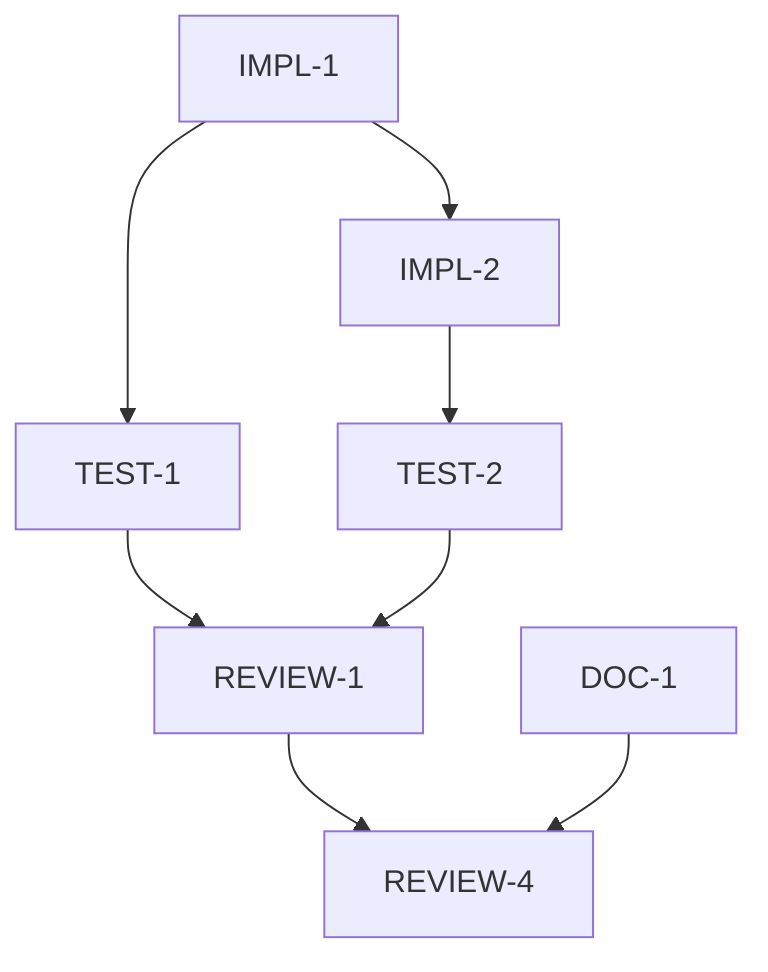

# Tasks: [Change ID]

---

## Document Overview

**Purpose**: Break down a project or change into actionable, trackable tasks.
**Change ID**: `[change-id]`
**Related Proposal**: [Link to proposal.md]
**Related Spec**: [Link to spec.md]
**Owner**: @[username]
**Status**: [Not Started / In Progress / Complete]

---

## Task Categories Legend

- **Implementation**: Code changes, development work
- **Testing**: Test creation, validation, QA
- **Documentation**: Docs, README, comments
- **Infrastructure**: DevOps, deployment, tooling
- **Review**: Code review, design review, approval

---

## Priority & Effort Guide

**Priority Levels**:
- **P0**: Critical, blocking other work
- **P1**: High priority, required for release
- **P2**: Important but not blocking
- **P3**: Nice-to-have, can be deferred

**Effort Estimates**:
- **XS**: < 1 hour
- **S**: 1-4 hours
- **M**: 4-8 hours (1 day)
- **L**: 1-3 days
- **XL**: 3-5 days
- **XXL**: > 1 week (break down further)

---

## Table of Contents

01. [Task Summary](#task-summary)
02. [Timeline & Schedule](#timeline--schedule)
03. [Resource Allocation](#resource-allocation)
04. [Success Criteria](#success-criteria)
05. [Task Dependencies](#task-dependencies)
06. [Implementation Tasks](#implementation-tasks)
07. [Testing Tasks](#testing-tasks)
08. [Documentation Tasks](#documentation-tasks)
09. [Infrastructure Tasks](#infrastructure-tasks)
10. [Review & Approval Tasks](#review--approval-tasks)
11. [Post-Deployment Tasks](#post-deployment-tasks)
12. [Risk Register](#risk-register)
13. [Communication Plan](#communication-plan)
14. [Validation Checklist](#validation-checklist)
15. [Change Log](#change-log)

---

## Task Summary

**Total Tasks**: [X]
**Completed**: [X]
**In Progress**: [X]
**Blocked**: [X]

**Overall Progress**: [X%]

**Estimated Effort**: [Total hours/days]
**Actual Effort**: [Total hours/days spent]

---

## Timeline & Schedule

**Project Timeline**:
- **Start Date**: [YYYY-MM-DD]
- **Target Completion**: [YYYY-MM-DD]
- **Actual Completion**: [YYYY-MM-DD]

**Key Milestones**:

| Milestone | Description | Target Date | Actual Date | Status |
|-----------|-------------|-------------|-------------|--------|
| M1: Planning Complete | All planning docs approved | [YYYY-MM-DD] | [YYYY-MM-DD] | [not-started/in-progress/completed] |
| M2: Development Complete | All implementation tasks done | [YYYY-MM-DD] | [YYYY-MM-DD] | [not-started/in-progress/completed] |
| M3: Testing Complete | All tests passing | [YYYY-MM-DD] | [YYYY-MM-DD] | [not-started/in-progress/completed] |
| M4: Documentation Complete | All docs updated | [YYYY-MM-DD] | [YYYY-MM-DD] | [not-started/in-progress/completed] |
| M5: Release | Production deployment | [YYYY-MM-DD] | [YYYY-MM-DD] | [not-started/in-progress/completed] |

**Critical Path**:
- [Task ID] → [Task ID] → [Task ID] (longest chain determining project duration)

**Buffer Time**: [X days/hours allocated for unforeseen delays]

---

## Resource Allocation

**Team Members**:

| Name | Role | Availability | Allocated Tasks | Workload |
|------|------|--------------|-----------------|----------|
| @[username] | Developer | [X hrs/week] | [Task IDs] | [X%] |
| @[username] | Tester | [X hrs/week] | [Task IDs] | [X%] |
| @[username] | Reviewer | [X hrs/week] | [Task IDs] | [X%] |

**Required Tools/Licenses**:
- [Tool 1]: [Purpose] - [Cost/Status]
- [Tool 2]: [Purpose] - [Cost/Status]
- [Service 1]: [Purpose] - [Cost/Status]

**Budget Allocation**:

| Category | Allocated | Spent | Remaining |

|----------|-----------|-------|-----------|
| Development | $[amount] | $[amount] | $[amount] |
| Testing | $[amount] | $[amount] | $[amount] |
| Infrastructure | $[amount] | $[amount] | $[amount] |
| Tools/Licenses | $[amount] | $[amount] | $[amount] |
| **Total** | **$[total]** | **$[total]** | **$[total]** |

**External Dependencies**:
- [Vendor/Service]: [What's needed] - [Status] - [Contact]

---

## Success Criteria

**Project Acceptance Criteria**:
- [ ] All P0 and P1 tasks completed
- [ ] All tests passing with ≥ [X]% coverage
- [ ] No critical or high-severity bugs
- [ ] Performance meets all specified targets
- [ ] Security review passed
- [ ] Documentation complete and reviewed
- [ ] Stakeholder approval obtained

**Quality Gates**:

| Gate | Criteria | Status |

|------|----------|--------|
| Code Quality | No critical linter issues, complexity < [X] | [Pass/Fail] |
| Test Coverage | Unit: ≥[X]%, Integration: ≥[Y]% | [Pass/Fail] |
| Performance | All endpoints < [X]ms | [Pass/Fail] |
| Security | No high/critical vulnerabilities | [Pass/Fail] |
| Documentation | All sections complete, reviewed | [Pass/Fail] |

**Definition of Done**:
- Code written and reviewed
- Tests written and passing
- Documentation updated
- CI/CD pipeline passing
- Deployed to staging/production
- Stakeholders notified
- Retrospective completed

---

## Task Dependencies

**Dependency Table**:

| Task ID | Depends On | Blocks |

|---------|------------|--------|
| IMPL-1  | None       | IMPL-2, TEST-1 |
| IMPL-2  | IMPL-1     | TEST-2 |
| TEST-1  | IMPL-1     | REVIEW-1 |
| TEST-2  | IMPL-2     | REVIEW-1 |
| REVIEW-1| TEST-1, TEST-2 | REVIEW-4 |

**Critical Path Analysis**:
- **Longest Path**: [IMPL-1 → IMPL-2 → TEST-2 → REVIEW-1 → REVIEW-4]
- **Estimated Duration**: [X days/hours]
- **Parallel Opportunities**: [Tasks that can run simultaneously]

**Dependency Notes**:
- Update this section as tasks are added/removed
- Identify blocking tasks that need immediate attention
- Consider breaking down tasks with many dependencies

---

## Implementation Tasks

### Backend Changes

- [ ] **IMPL-1**: [Task description]
    - **Priority**: [P0/P1/P2/P3]
    - **Effort**: [XS/S/M/L/XL]
    - **Owner**: @[username]
    - **Status**: [not-started/in-progress/completed/blocked]
    - **Dependencies**: [List task IDs or "None"]
    - **Acceptance Criteria**: [What must be true when complete]

- [ ] **IMPL-2**: [Task description]
    - **Priority**: [P0/P1/P2/P3]
    - **Effort**: [XS/S/M/L/XL]
    - **Owner**: @[username]
    - **Status**: [not-started/in-progress/completed/blocked]
    - **Dependencies**: [Task IDs]
    - **Acceptance Criteria**: [Criteria]

### Frontend/Plugin Changes

- [ ] **IMPL-3**: [Task description]
    - **Priority**: [P0/P1/P2/P3]
    - **Effort**: [XS/S/M/L/XL]
    - **Owner**: @[username]
    - **Status**: [not-started/in-progress/completed/blocked]
    - **Dependencies**: [Task IDs]
    - **Acceptance Criteria**: [Criteria]

### Database/Schema Changes

- [ ] **IMPL-4**: [Task description]
    - **Priority**: [P0/P1/P2/P3]
    - **Effort**: [XS/S/M/L/XL]
    - **Owner**: @[username]
    - **Status**: [not-started/in-progress/completed/blocked]
    - **Dependencies**: [Task IDs]
    - **Acceptance Criteria**: [Criteria]

### API Changes

- [ ] **IMPL-5**: [Task description]
    - **Priority**: [P0/P1/P2/P3]
    - **Effort**: [XS/S/M/L/XL]
    - **Owner**: @[username]
    - **Status**: [not-started/in-progress/completed/blocked]
    - **Dependencies**: [Task IDs]
    - **Acceptance Criteria**: [Criteria]

---

## Testing Tasks

### Unit Tests

- [ ] **TEST-1**: [Test description]
    - **Priority**: [P0/P1/P2/P3]
    - **Effort**: [XS/S/M/L/XL]
    - **Owner**: @[username]
    - **Status**: [not-started/in-progress/completed/blocked]
    - **Dependencies**: [Implementation task IDs]
    - **Coverage Target**: [%]

### Integration Tests

- [ ] **TEST-2**: [Test description]
    - **Priority**: [P0/P1/P2/P3]
    - **Effort**: [XS/S/M/L/XL]
    - **Owner**: @[username]
    - **Status**: [not-started/in-progress/completed/blocked]
    - **Dependencies**: [Task IDs]
    - **Coverage Target**: [%]

### End-to-End Tests

- [ ] **TEST-3**: [Test description]
    - **Priority**: [P0/P1/P2/P3]
    - **Effort**: [XS/S/M/L/XL]
    - **Owner**: @[username]
    - **Status**: [not-started/in-progress/completed/blocked]
    - **Dependencies**: [Task IDs]
    - **Test Scenarios**: [List key scenarios]

### Performance Tests

- [ ] **TEST-4**: [Test description]
    - **Priority**: [P0/P1/P2/P3]
    - **Effort**: [XS/S/M/L/XL]
    - **Owner**: @[username]
    - **Status**: [not-started/in-progress/completed/blocked]
    - **Dependencies**: [Task IDs]
    - **Performance Target**: [e.g., <200ms response time]

### Security Tests

- [ ] **TEST-5**: [Test description]
    - **Priority**: [P0/P1/P2/P3]
    - **Effort**: [XS/S/M/L/XL]
    - **Owner**: @[username]
    - **Status**: [not-started/in-progress/completed/blocked]
    - **Dependencies**: [Task IDs]
    - **Security Checks**: [List security validations]

---

## Documentation Tasks

### Code Documentation

- [ ] **DOC-1**: Add inline comments and docstrings
    - **Priority**: [P0/P1/P2/P3]
    - **Effort**: [XS/S/M/L/XL]
    - **Owner**: @[username]
    - **Status**: [not-started/in-progress/completed/blocked]
    - **Files Affected**: [List files]

### User Documentation

- [ ] **DOC-2**: Update user-facing documentation
    - **Priority**: [P0/P1/P2/P3]
    - **Effort**: [XS/S/M/L/XL]
    - **Owner**: @[username]
    - **Status**: [not-started/in-progress/completed/blocked]
    - **Documents**: [README.md, docs/GUIDE.md, etc.]

### API Documentation

- [ ] **DOC-3**: Update API reference documentation
    - **Priority**: [P0/P1/P2/P3]
    - **Effort**: [XS/S/M/L/XL]
    - **Owner**: @[username]
    - **Status**: [not-started/in-progress/completed/blocked]
    - **APIs Affected**: [List endpoints]

### Changelog

- [ ] **DOC-4**: Update CHANGELOG.md
    - **Priority**: [P0/P1/P2/P3]
    - **Effort**: [XS]
    - **Owner**: @[username]
    - **Status**: [not-started/in-progress/completed/blocked]
    - **Version**: [Version number]

### Migration Guide

- [ ] **DOC-5**: Create migration guide (if breaking changes)
    - **Priority**: [P0/P1/P2/P3]
    - **Effort**: [XS/S/M/L/XL]
    - **Owner**: @[username]
    - **Status**: [not-started/in-progress/completed/blocked]
    - **Breaking Changes**: [List breaking changes]

---

## Infrastructure Tasks

### CI/CD Updates

- [ ] **INFRA-1**: Update CI/CD pipeline
    - **Priority**: [P0/P1/P2/P3]
    - **Effort**: [XS/S/M/L/XL]
    - **Owner**: @[username]
    - **Status**: [not-started/in-progress/completed/blocked]
    - **Changes**: [Describe pipeline changes]

### Deployment Scripts

- [ ] **INFRA-2**: Update deployment scripts
    - **Priority**: [P0/P1/P2/P3]
    - **Effort**: [XS/S/M/L/XL]
    - **Owner**: @[username]
    - **Status**: [not-started/in-progress/completed/blocked]
    - **Scripts**: [List scripts to update]

### Environment Configuration

- [ ] **INFRA-3**: Update environment configuration
    - **Priority**: [P0/P1/P2/P3]
    - **Effort**: [XS/S/M/L/XL]
    - **Owner**: @[username]
    - **Status**: [not-started/in-progress/completed/blocked]
    - **Config Files**: [List config files]

### Monitoring & Logging

- [ ] **INFRA-4**: Add/update monitoring and logging
    - **Priority**: [P0/P1/P2/P3]
    - **Effort**: [XS/S/M/L/XL]
    - **Owner**: @[username]
    - **Status**: [not-started/in-progress/completed/blocked]
    - **Metrics**: [List metrics to track]

---

## Review & Approval Tasks

### Code Review

- [ ] **REVIEW-1**: Code review completed
    - **Priority**: [P0/P1/P2/P3]
    - **Effort**: [XS/S/M/L/XL]
    - **Reviewer**: @[username]
    - **Status**: [not-started/in-progress/completed/blocked]
    - **PRs**: [List PR numbers]

### Design Review

- [ ] **REVIEW-2**: Design review completed
    - **Priority**: [P0/P1/P2/P3]
    - **Effort**: [XS/S/M/L/XL]
    - **Reviewer**: @[username]
    - **Status**: [not-started/in-progress/completed/blocked]
    - **Design Docs**: [Links to design documents]

### Security Review

- [ ] **REVIEW-3**: Security review completed
    - **Priority**: [P0/P1/P2/P3]
    - **Effort**: [XS/S/M/L/XL]
    - **Reviewer**: @[username]
    - **Status**: [not-started/in-progress/completed/blocked]
    - **Security Concerns**: [List any concerns]

### Stakeholder Approval

- [ ] **REVIEW-4**: Stakeholder sign-off obtained
    - **Priority**: [P0/P1/P2/P3]
    - **Effort**: [XS]
    - **Approver**: @[username]
    - **Status**: [not-started/in-progress/completed/blocked]
    - **Approval Date**: [Date]

---

## Post-Deployment Tasks

### Monitoring Validation

- [ ] **POST-1**: Verify monitoring and alerts are working
    - **Priority**: [P0/P1/P2/P3]
    - **Effort**: [XS/S/M/L/XL]
    - **Owner**: @[username]
    - **Status**: [not-started/in-progress/completed/blocked]
    - **Metrics to Verify**: [List key metrics]

### Performance Validation

- [ ] **POST-2**: Validate production performance
    - **Priority**: [P0/P1/P2/P3]
    - **Effort**: [XS/S/M/L/XL]
    - **Owner**: @[username]
    - **Status**: [not-started/in-progress/completed/blocked]
    - **Performance Targets**: [List targets to validate]

### User Training

- [ ] **POST-3**: Conduct user training/onboarding
    - **Priority**: [P0/P1/P2/P3]
    - **Effort**: [XS/S/M/L/XL]
    - **Owner**: @[username]
    - **Status**: [not-started/in-progress/completed/blocked]
    - **Audience**: [Who needs training]

### Documentation Review

- [ ] **POST-4**: Verify all documentation is accessible
    - **Priority**: [P0/P1/P2/P3]
    - **Effort**: [XS]
    - **Owner**: @[username]
    - **Status**: [not-started/in-progress/completed/blocked]
    - **Docs to Verify**: [List documentation]

### Stakeholder Notification

- [ ] **POST-5**: Notify stakeholders of completion
    - **Priority**: [P0/P1/P2/P3]
    - **Effort**: [XS]
    - **Owner**: @[username]
    - **Status**: [not-started/in-progress/completed/blocked]
    - **Communication Method**: [Email, meeting, etc.]

### Retrospective

- [ ] **POST-6**: Conduct project retrospective
    - **Priority**: [P1]
    - **Effort**: [S/M]
    - **Owner**: @[username]
    - **Status**: [not-started/in-progress/completed/blocked]
    - **Participants**: [List participants]
    - **Schedule**: [Date/time]

### Knowledge Transfer

- [ ] **POST-7**: Complete knowledge transfer
    - **Priority**: [P0/P1/P2/P3]
    - **Effort**: [XS/S/M/L/XL]
    - **Owner**: @[username]
    - **Status**: [not-started/in-progress/completed/blocked]
    - **To**: [Team/person receiving transfer]

---

## Task Dependencies

**Dependency Table**:

| Task ID | Depends On | Blocks |

|---------|------------|--------|
| IMPL-1  | None       | IMPL-2, TEST-1 |
| IMPL-2  | IMPL-1     | TEST-2 |
| TEST-1  | IMPL-1     | REVIEW-1 |
| TEST-2  | IMPL-2     | REVIEW-1 |
| REVIEW-1| TEST-1, TEST-2 | REVIEW-4 |

---

## Risk Register

**Active Risks**:

| Risk ID | Description | Probability | Impact | Severity | Owner | Mitigation Strategy | Status |

|---------|-------------|-------------|--------|----------|-------|---------------------|--------|
| RISK-1  | [Risk description] | [Low/Medium/High] | [Low/Medium/High] | [P0/P1/P2/P3] | @[username] | [Mitigation plan] | [Open/Mitigated/Closed] |
| RISK-2  | [Risk description] | [Low/Medium/High] | [Low/Medium/High] | [P0/P1/P2/P3] | @[username] | [Mitigation plan] | [Open/Mitigated/Closed] |

**Risk Mitigation Tasks**:
- [ ] **RISK-T1**: [Mitigation task for RISK-1]
    - **Owner**: @[username]
    - **Due Date**: [YYYY-MM-DD]
    - **Status**: [not-started/in-progress/completed]

**Closed/Resolved Risks**:
- **RISK-X**: [Description] - Resolved: [YYYY-MM-DD] - Resolution: [How it was resolved]

---

## Communication Plan

**Status Updates**:
- **Frequency**: [Daily/Weekly/Bi-weekly]
- **Format**: [Standup/Email/Slack/Meeting]
- **Audience**: [Team/Stakeholders/All]
- **Owner**: @[username]

**Stakeholder Communication**:

| Stakeholder | Role | Update Frequency | Communication Method | Key Topics |
|-------------|------|------------------|---------------------|------------|
| @[username] | Project Sponsor | Weekly | Email + Meeting | Progress, risks, budget |
| @[username] | Technical Lead | Daily | Standup | Technical issues, blockers |
| @[username] | Product Owner | Bi-weekly | Meeting | Features, acceptance |

**Escalation Path**:
1. **Level 1** (Team Lead): For task-level issues → @[username]
2. **Level 2** (Project Manager): For project-level blockers → @[username]
3. **Level 3** (Executive Sponsor): For strategic decisions → @[username]

**Decision Log**:
- [YYYY-MM-DD]: [Decision made] - [Rationale] - [Decided by]

**Meeting Schedule**:
- **Daily Standup**: [Time] - [Duration] - [Participants]
- **Weekly Review**: [Time] - [Duration] - [Participants]
- **Sprint Planning**: [Frequency] - [Duration] - [Participants]

---

## Validation Checklist

### Pre-Implementation Validation

- [ ] Proposal reviewed and approved
- [ ] Specification complete and signed off
- [ ] All dependencies identified and ready
- [ ] Development environment set up
- [ ] Required access/permissions obtained

### Implementation Validation

- [ ] All implementation tasks completed
- [ ] Code follows style guidelines
- [ ] No compiler/linter errors
- [ ] All new code has comments/docstrings
- [ ] No hardcoded secrets or credentials

### Testing Validation

- [ ] All tests pass locally
- [ ] Code coverage meets target (≥ X%)
- [ ] Integration tests pass
- [ ] Performance tests meet targets
- [ ] Security scans pass (no critical/high issues)

### Documentation Validation

- [ ] README.md updated
- [ ] API documentation updated
- [ ] CHANGELOG.md updated
- [ ] Migration guide created (if needed)
- [ ] Examples/tutorials updated

### Deployment Validation

- [ ] CI/CD pipeline passes
- [ ] Deployment scripts tested
- [ ] Environment configs validated
- [ ] Rollback plan documented
- [ ] Monitoring/alerts configured

### Final Validation

- [ ] All tasks completed
- [ ] All reviews/approvals obtained
- [ ] PR created and merged
- [ ] Release tagged (if applicable)
- [ ] Stakeholders notified
- [ ] OpenSpec validation: `openspec validate [change-id] --strict`

---

## Notes & Issues

**Blockers**:
- [List any blocking issues]

**Risks**:
- [List potential risks]

**Decisions Made**:
- [Record key decisions during implementation]

**Lessons Learned**:
- [Capture insights for future reference]

---

## Change Log

**Task Plan Changes**:

| Date | Change Type | Description | Reason | Approved By |
|------|-------------|-------------|--------|-------------|
| [YYYY-MM-DD] | [Scope/Task/Timeline/Resource] | [What changed] | [Why it changed] | @[username] |
| [YYYY-MM-DD] | [Added Tasks] | [New tasks: TASK-X, TASK-Y] | [New requirement discovered] | @[username] |
| [YYYY-MM-DD] | [Removed Tasks] | [Removed: TASK-Z] | [Out of scope] | @[username] |

**Scope Changes**:
- [YYYY-MM-DD]: **Added** - [Feature/requirement added] - Reason: [Why]
- [YYYY-MM-DD]: **Removed** - [Feature/requirement removed] - Reason: [Why]

**Timeline Adjustments**:
- [YYYY-MM-DD]: Target completion moved from [old date] to [new date] - Reason: [Why]

**Resource Changes**:
- [YYYY-MM-DD]: @[username] added to team as [role]
- [YYYY-MM-DD]: @[username] reallocated from [X]% to [Y]%

---

## Document Metadata

- **Created**: [YYYY-MM-DD]
- **Last Updated**: [YYYY-MM-DD]
- **Version**: [v1.0]
- **Authors**: @[username]
